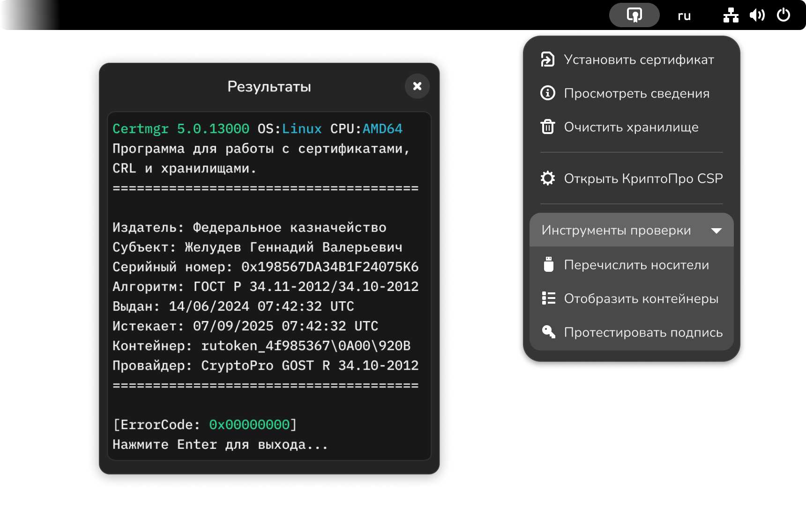

# CryptoPro Utilities

Расширение предназначено для управления сертификатами электронной подписи
в пользовательском окружении через криптопровайдер «КриптоПро CSP». Обеспечена
совместимость с GNOME 45-47. Для работы необходимы пакеты из стандартной
поставки дистрибутива «КриптоПро CSP» для Linux.



Подтверждена работоспособность на Fedora 41 и ALT Regular Gnome c использованием
«КриптоПро CSP 5.0».

## Возможности

* Установить сертификат  
Добавляет сертификат в личное хранилище пользователя.
* Просмотреть сведения  
Отображает информацию о сертификате в хранилище.
* Очистить хранилище  
Удаляет сертификаты из личного хранилища пользователя.
* Открыть КриптоПро CSP  
Предоставляет доступ к графическому интерфейсу управления.
* Перечислить носители  
Выводит перечень подключенных ключевых носителей.
* Отобразить контейнеры  
Проверяет ключевые носители на наличие контейнеров.
* Протестировать подпись  
Выполняет локальное тестирование электронной подписи.

Действия перечислены в файле `actions.json`, поэтому в целях администрирования
имеется возможность внести изменения перед сборкой и установкой расширения.

## Установка

```sh
git clone https://github.com/vmkspv/cryptopro-utils.git
cd cryptopro-utils
gnome-extensions pack --extra-source=actions.json
gnome-extensions install cryptopro-utils@vmkspv.github.com.shell-extension.zip
gnome-extensions enable cryptopro-utils@vmkspv.github.com
```

В коде `extension.js` содержатся переменные `filePath` и `file`, указывающие
на расположение расширения и файл действий. При системной установке перед
сборкой потребуется актуализировать данные.

## Лицензия

Исходный код распространяется в соответствии с Государственной открытой лицензией
версии 1.1. Подробные сведения доступны в [файле лицензии](LICENSE).

> *Проект является независимой разработкой и не имеет финансовой поддержки,
официальной аффилиации или любой другой связи с ООО «Крипто-Про».*
